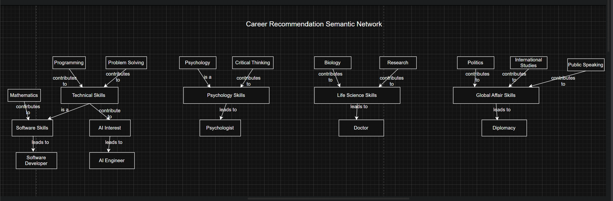

# Career Recommendation Expert System

## Problem Being Solved

Choosing a suitable career can be difficult for students because they often have multiple interests and limited guidance. This system helps solve this problem by recommending careers based on user interests using a rule-based expert system with forward chaining inference.


## Facts Used

The system uses the following facts as user interests:

* programming
* problem_solving
* mathematics
* biology
* psychology
* film
* creativity
* storytelling
* helping_people
* research
* critical_thinking
* politics
* international_relations
* public_speaking
* ai


## Rules Used

### Technology 

* IF programming AND problem_solving THEN technical_skills
* IF programming AND mathematics THEN software_skills
* IF software_skills THEN Software Developer

### Medicine

* IF biology AND research THEN life_science_skills
* IF life_science_skills AND helping_people THEN medical_candidate
* IF medical_candidate THEN Doctor

### Psychology

* IF psychology AND critical_thinking THEN psychology_skills
* IF psychology_skills AND helping_people THEN counseling_candidate
* IF counseling_candidate THEN Psychologist

### Film and Media

* IF film AND creativity THEN media_skills
* IF media_skills AND storytelling THEN film_candidate
* IF film_candidate THEN Film Director

### International Relations

* IF politics AND international_relations AND public_speaking THEN Diplomat


## How Inference Works (Forward Chaining)

The system uses forward chaining inference to derive conclusions step by step:

1. User inputs interests.
2. Inputs are converted into initial facts.
3. The system checks all rules in the knowledge base.
4. If rule conditions are satisfied, a new fact is generated.
5. Newly generated facts are added back into the fact set.
6. The process repeats until no new facts can be generated.
7. Final career recommendations are produced.

### Example Reasoning

```text
programming + problem_solving
→ technical_skills
→ AI_Candidate
→ Artificial Intelligence Engineer
```


## Semantic Network Representation

The system can also be represented using a semantic network, which shows relationships between concepts visually.

### Concept Levels

The system is structured into three layers:

### 1. Interest Level (Input Facts)

These are user-provided interests such as:

* Programming
* Biology
* Psychology
* Film
* Politics


### 2. Skill Level (Intermediate Concepts)

These are derived from input facts:

* Technical Skills
* Life Science Skills
* Psychology Skills
* Media Skills
* Global Affairs Skills
* Software Skills


### 3. Career Level (Final Output)

These represent final recommendations:

* Software Developer
* Doctor
* Psychologist
* Film Director
* Diplomat


### Semantic Relationships 

```text

```


## How to Run the System

### Requirements

* Python 3.x

### Run Command

```bash
python main.py
```


## Sample Input

```text
Enter your Interests separated by comma

Your interests: programming, software_skills

```

## Sample Output

```text
Intial Facts: {'software_skills', 'programming'}

 Running Inference Engine

Rule Fired -> ['software_skills'] => Software Developer

 Final Career Recommendations

Software Developer

 Reasoning Process

['software_skills'] => Software Developer
```


## Conclusion

This system demonstrates a rule-based expert system using forward chaining inference. It successfully models knowledge using facts and rules, performs multi-step reasoning, and produces career recommendations. The semantic network representation further enhances understanding of relationships between concepts in the system.
